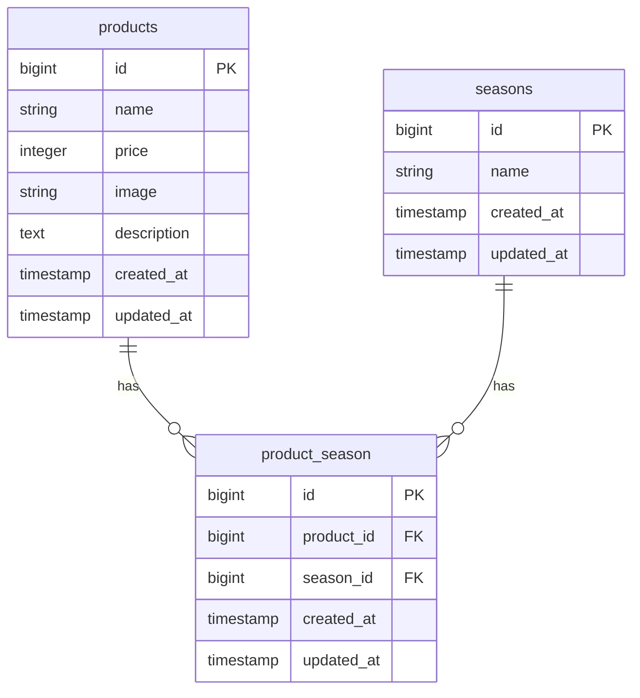

# mogitate

## 環境構築

### Dockerビルド

- git clone git@github.com:sae0715/mogitate.git
- docker-compose up -d --build

### Laravel環境構築

- docker-compose exec php bash
- composer install
- cp .env.example .env , 環境変数を適宜変更
- php artisan key:generate
- php artisan migrate
- php artisan db:seed

## 開発環境

- 商品一覧画面：http://localhost/products
- 商品登録画面：http://localhost/products/register
- phpMyAdmin：http://localhost:8080/

## 使用技術(実行環境)

- PHP 8.2.11
- Laravel 8.83.8
- MySQL 8.0.26
- nginx 1.21.1

## ER図

## URL

- 開発環境：http://localhost/